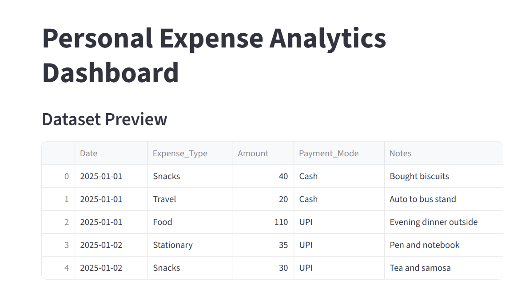

Name: Mahima Kari  
Domain: Data Analytics  
Organization: CodtechIT Solutions Private Limited  
Internship Period: 17 May 2026 - 28 June 2026  
Intern ID: CITS846  

Personal Expense Analytics

Project Overview
This project analyzes personal or hostel expense data using Python and visualizes important financial insights through graphs and dashboards. The project performs data cleaning, visualization, and expense analysis to understand spending patterns. It helps in tracking expenses and identifying category-wise spending trends.

The project is built using:

Pandas  
Matplotlib  
Streamlit  

Features
Data Cleaning and Preprocessing  
Category-wise Expense Analysis  
Total Expense Calculation  
Expense Distribution Visualization  
Monthly Expense Trend Analysis  
Interactive Streamlit Dashboard  

Technologies Used
Python  
Pandas  
Matplotlib  
Streamlit  

Dataset Used
The dataset used in this project:

hostel_life_expense_tracker.csv  

Dataset contains:

Expense Type / Category  
Amount  
Date (optional)  

Project Structure

Personal-Expense-Analytics/

│── app.py  
│── analysis.py  
│── hostel_life_expense_tracker.csv   
│── README.md  

Visualizations Included
Expense by Category  
Expense Distribution  
Monthly Expense Trend  

Streamlit Dashboard
Interactive dashboard created using Streamlit to display:

Dataset Preview  
Total Expense  
Category-wise Analysis  
Graph Visualizations  
Monthly Trend Analysis  

Run Dashboard
python -m streamlit run app.py  

Project Output
The project generates:

Expense Analysis Charts  
Spending Insights  
Dashboard Visualizations  
Financial Trend Reports

Dashboard

  Local URL: http://localhost:8501
  
  Network URL: http://192.168.1.10:8501

  Output:
## Output Screenshots

### Dashboard

### Expense by Category

### Total Expense

### Expense Distribution

### Monthly Expense Trend

